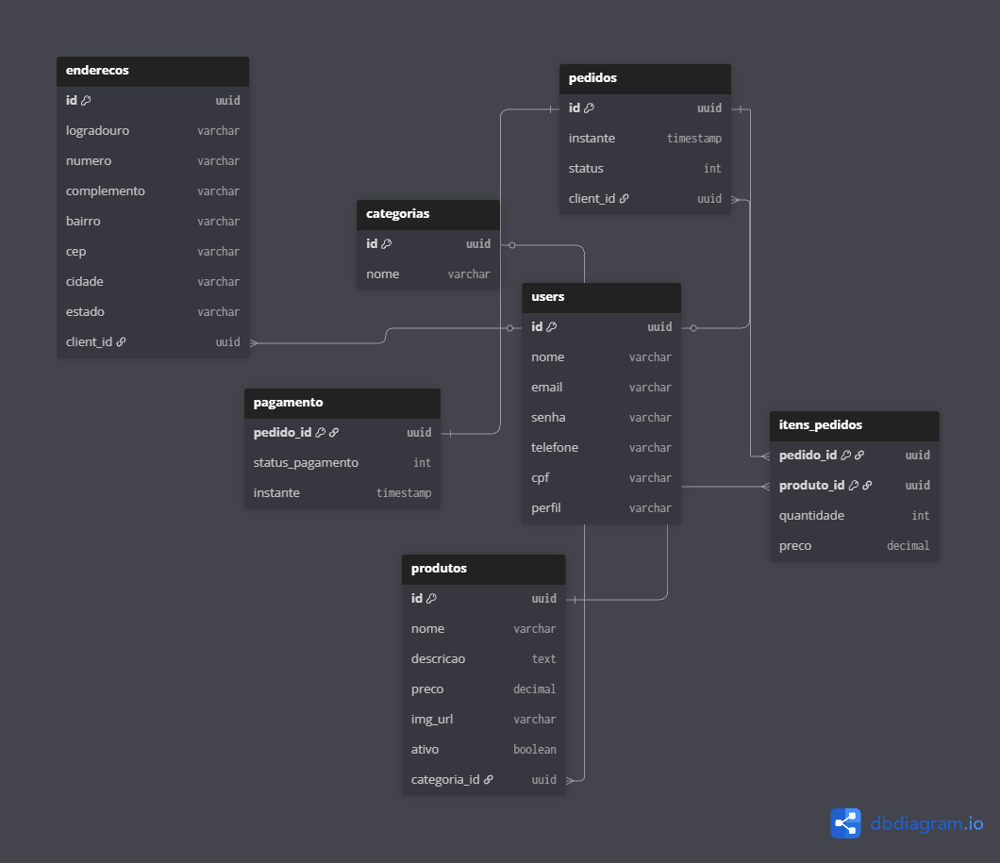

# Modelagem de Banco de Dados
Documenta detalha a estrutura inicial do banco de dados para o E-commerce da Confeitaria.

## Decisões

### 1. Endereçamento 
- Embora o sistema tenha campos para Cidade e Estado ('tb_enderecos'), inicialmente a regra de negócio restringirá o cadastro apenas para **Salvador  - BA**.
- A estrutura foi mantida completa  para permitir expansão futura para regiões metropolitanas (ex: Lauro de Freitas) sem  necessidade de refatorar o banco.

###  2. Categorização
-  Categoria será uma Tabela em vez de um ENUM, permitindo que o (a) ADMIN adicione categorias de doces pelo painel.

### 3. Status do  Pedido
- O  status será salvo como  'INTEGER' no  banco, mapeado para um ENUM no  Java, seguindo o fluxo: AGUARDANDO -> PAGO -> EM_PREPARACAO -> SAIU_PARA_ENTREGA -> ENTREGUE.